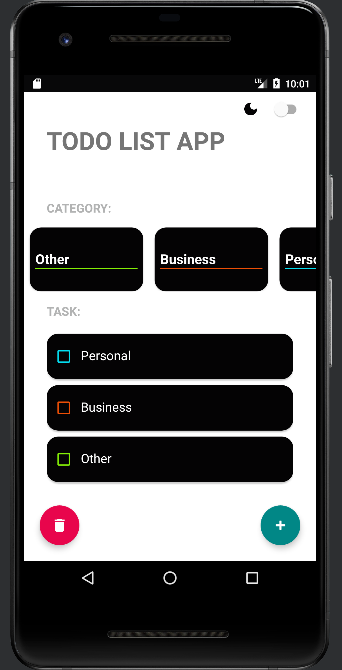
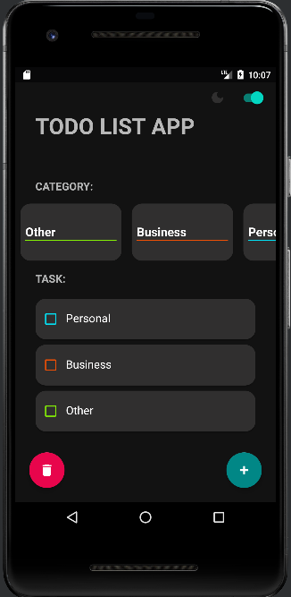
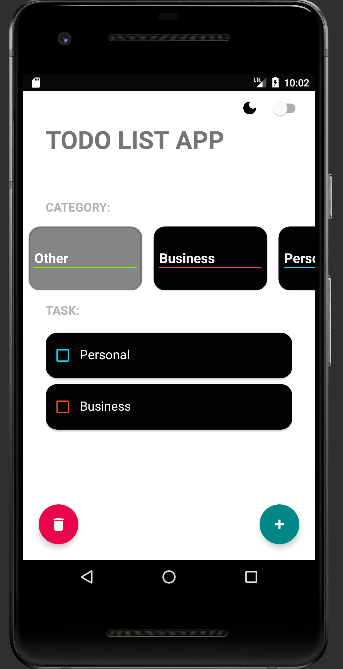
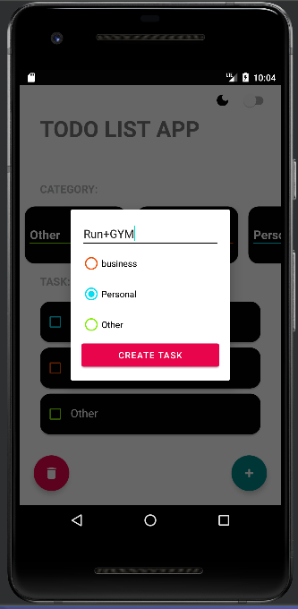

# ToDoAPP 📑📚 

## My Android project is a ToDo application that will list the tasks you need, categorizing them for better organization. With this application, you can create and maintain a list of pending tasks, assigning them to specific categories for efficient management. Simplify your daily life by effectively managing your tasks and ensuring you don't forget any important ones


## characteristics

- Use of RecyclerView
- Layout with XML
- Data storage for persistence
- Dark mode
- Task deletion
 -Task creation


## Installation:

```
Dependencies{
implementation "androidx.datastore:datastore-preferences:1.0.0"
}
```


# Layout

## Presentation


## DarkMode

## Ignoring the 'other' field

## Creating a task


## Deleting a task
